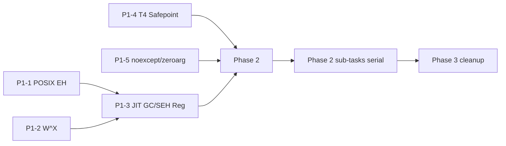

# Roadmap v1.1 — Execution Path Risk Remediation (Approach B: Foundation First)

## 1. 目标

修复 AOT/JIT/Interpreter 执行路径上发现的全部 43 个风险项（9 CRITICAL, 8 HIGH, 14 MEDIUM, 12 LOW），按"先加固基础设施 → 再修并发安全 → 最后清理"的优先级顺序推进。确保所有执行路径在 POSIX 平台上享有与 Windows SEH 同等水平的异常安全、内存保护和并发安全。

## 2. 范围边界

- **POSIX 平台** (Linux x86_64): EH 保护、W^X 合规、信号安全
- **JIT 引擎**: GC/SEH 注册、safepoint polling、slot patching 保护
- **Interpreter**: noexcept 安全、zero-arg fast path 保护、整数安全
- **Hotpatch 系统**: TOCTOU 竞争、keep-native 语义一致性
- **Deopt 系统**: use-after-free 保护

## 3. 非目标

- Windows SEH 改动（已有完整保护，不做冗余更改）
- codegen 改动（不在本 roadmap 范围内）
- 新功能添加（只修既有风险，不引入新能力）
- 性能优化（除了修复引入的性能回归，不做纯粹的优化工作）
- Interpreter Dispatch 架构重构（只修 bug，不改结构）
- Arm64 平台风险（不在当前评估范围内）

## 4. 全局优先级约束

| 阶段 | P1 (性能最优) | P2 (方案完美) | P3 (HotUpdate) |
|------|-------------|-------------|---------------|
| Phase 1: Platform | POSIX EH 仅信号时触发 + W^X 零分配路径开销 | POSIX EH 与 SEH 语义对等 | Hotpatch TOCTOU 后置到 Phase 2 |
| Phase 2: Concurrency | 热路径无额外 fence | RCU/epoch 替代简单锁 | TOCTOU 保护直接提升热更新可靠性 |
| Phase 3: Cleanup | 整数检查仅 debug 构建生效 | 统一错误处理模式 | N/A |

**裁决说明**: Phase 1 中 W^X mprotect 在 slot patching 热路径上可能引入单次系统调用开销（~50ns），但这是安全合规的必要开销，P1 安全 >= P1 性能在此场景成立。

## 5. 阶段列表

### Phase 1: Platform & Infrastructure（预计 2-3 周）

强化核心基础设施：POSIX EH、W^X 合规、JIT 基础注册框架、safepoint 覆盖。

| 子任务 | 风险项 | 优先级 | 文件范围 |
|--------|--------|--------|---------|
| P1-1: POSIX EH | [P0-CR-01] PalTryCallNoExcept passthrough | CRITICAL | pal_eh_posix.cpp, eh.h, exception_jmp.h |
| P1-2: W^X Compliance | [P0-CR-02] precode RWX, [P0-CR-05] slot patching ignore failure | CRITICAL | precode.cpp, slot_map.h, jit_precode.cpp |
| P1-3: JIT GC/SEH Registration | [P0-CR-03] JitStubDispatchImpl missing registration, [P0-CR-04] Compile() missing, [P0-HI-02] call slot RX write | CRITICAL + HIGH | jit_precode.cpp, jit_engine.cpp, code_registry.h |
| P1-4: T4 Safepoint | [P0-CR-06] safepoint_fn = nullptr | CRITICAL | ir_reg_alloc.cpp, osr_trigger.cpp, fast_dispatch.cpp |
| P1-5: noexcept + zero-arg | [P0-CR-07] noexcept violate + [P0-HI-05] zero-arg bypass | CRITICAL + HIGH | fast_dispatch.cpp, hotpatch_dispatch.h |

### Phase 2: Concurrency Safety & Architecture（预计 1-2 周）

修复并发安全漏洞和数据竞争。

| 子任务 | 风险项 | 优先级 | 文件范围 |
|--------|--------|--------|---------|
| P2-1: Tier 1 UAF | [P0-CR-08] tier 1 recompilation use-after-free | CRITICAL | jit_precode.cpp, tier_manager.cpp |
| P2-2: Hotpatch TOCTOU | [P0-CR-09] SetPatchedBySlot TOCTOU | CRITICAL | hotpatch_table.cpp |
| P2-3: Stack Overflow Protection | [P0-HI-01] Handle_Div/Rem by zero (interpreter), [P0-ME-01] | HIGH | fast_dispatch.cpp, eh.h |
| P2-4: CastClass + Int Ops | [P0-HI-03] CastClass no-op (x64), [P0-ME-02..05] int overflow | HIGH + MEDIUM | fast_dispatch.cpp |

### Phase 3: Architecture Cleanup（预计 1 周）

修复 ~20 个 LOW/MEDIUM 风险项和架构一致性问题。

| 子任务 | 风险项范围 | 优先级范围 |
|--------|-----------|-----------|
| P3-1: Interpreter edge cases | LdArg OOB, OSR tracked obj ownership | MEDIUM |
| P3-2: JIT diagnostics & hardening | SEH V1 limit, deopt binary search | MEDIUM |
| P3-3: VTable/MethodTable noexcept audit | noexcept allocation functions | LOW |
| P3-4: General hardening | Remaining LOW items | LOW |

## 6. 每阶段完成定义

### Phase 1 完成定义

| 维度 | 条件 |
|------|------|
| goal | POSIX 平台 EH 保护对齐 Windows SEH；W^X 强制执行；JIT 注册框架完备；safepoint 全覆盖；热路径 noexcept 一致性 |
| exit_criteria | (1) PalTryCallNoExcept 使用 sigsetjmp/siglongjmp + signal handler 兜底, (2) precode arena 创建后 seal 为 RX, (3) slot patching 失败不再忽略, (4) JitStubDispatchImpl 注册 GC slot map + code section, (5) Compile() 注册 native code section, (6) T4 safepoint_fn 始终指向 SafepointPoll, (7) zero-arg 路径 wrapped, (8) hotpatch_dispatch.h 统一 noexcept 策略 |
| deliverables | 修改文件: pal_eh_posix.cpp, eh.h, exception_jmp.h, precode.cpp, slot_map.h, jit_precode.cpp, jit_engine.cpp, fast_dispatch.cpp, hotpatch_dispatch.h, ir_reg_alloc.cpp, osr_trigger.cpp |
| dependencies | 无（Phase 1 是基础层） |
| resolved_decisions | POSIX EH: Approach 1b (sigsetjmp/siglongjmp + signal handler); W^X: mprotect 调用 + 失败报错而非忽略 |
| watch_items | POSIX EH signal handler 对 SIGSEGV/SIGBUS 的过滤不能影响 JIT 正常信号处理; precode RW→RX seal 时间点选择（必须在所有 slot populated 之后） |

### Phase 2 完成定义

| 维度 | 条件 |
|------|------|
| goal | 消除 CRITICAL 级别并发安全漏洞 |
| exit_criteria | (1) Tier 1 使用 RCU/epoch 保护 recompilation, (2) SetPatchedBySlot TOCTOU 消除, (3) Handle_Div/Rem 整数除零保护, (4) CastClass 不再 no-op |
| deliverables | 修改: jit_precode.cpp, tier_manager.cpp, hotpatch_table.cpp, fast_dispatch.cpp |
| dependencies | Phase 1 完成（EH 保护提供安全执行基底） |
| resolved_decisions | Tier 1 UAF: RCU/epoch 方案; hotpatch TOCTOU: 读取/写入使用 relaxed ordering + check-guard |
| watch_items | RCU 回收延迟对内存压力的影响 |

### Phase 3 完成定义

| 维度 | 条件 |
|------|------|
| goal | 清理剩余 LOW/MEDIUM 风险项 |
| exit_criteria | (1) LdArg OOB 有 bound check, (2) OSR tracked obj 正确所有权管理, (3) SEH 使用限制有文档或自动 fallback, (4) deopt 距离 0 保护, (5) VTable/MethodTable noexcept 审记完成, (6) 其他 LOW 项已评估 |
| deliverables | 涉及 ~10 个文件 |
| dependencies | Phase 1 + Phase 2 完成 | 
| resolved_decisions | LOW 项统一推迟到 Phase 3，不做单独的子任务拆分 |
| watch_items | LOW 项可能有部分在实施中发现升级为 MEDIUM |

## 7. 子任务映射

### Phase 1

| task_id | phase | status | owner | purpose | depends_on | batch_id | requirements | deliverables | exit_criteria | conflict_scope | estimated_effort |
|---------|-------|--------|-------|---------|-----------|----------|-------------|-------------|-------------|---------------|-----------------|
| P1-1-posix-eh | phase-1 | planned | - | PalTryCallNoExcept POSIX 实现 sigsetjmp/siglongjmp + signal handler | none | - | sigsetjmp/siglongjmp 保护 + SIGSEGV/SIGBUS/BUS_ADRERR handler + 正确过滤 JIT 自用信号 + CHECK tier 测试覆盖 | pal_eh_posix.cpp, eh.h, exception_jmp.h, signal_handler.cpp | POSIX PalTryCallNoExcept 能捕获 SIGSEGV/SIGBUS；不干扰 JIT 正常信号处理；all tests pass | src/native/pal/ | 4-5 days |
| P1-2-wx-compliance | phase-1 | planned | - | Precode arena RW→RX seal + slot patching 强制 re-protection 且失败报错 | none | - | precode 创建时 RW、populate 后 seal 为 RX；slot_map.h re-protection 失败不再 return true 而是 assert/log + return false | precode.cpp, slot_map.h, jit_precode.cpp | precode 创建后 seal；slot patching 失败不再静默成功；no regression | src/native/jit/ | 2-3 days |
| P1-3-jit-gc-seh-reg | phase-1 | planned | - | JitStubDispatchImpl + Compile() 注册 GC slot map + native code section | P1-2 (shared jit_precode.cpp) | - | GcRegisterSlotMap + RegisterNativeCodeSection 在 JitStubDispatchImpl 中调用；Compile() 注册 native code section | jit_precode.cpp, jit_engine.cpp, code_registry.h | JIT 编译的代码有完整 GC/SEH 注册 | src/native/jit/ | 3-4 days |
| P1-4-t4-safepoint | phase-1 | planned | - | FastFrame/RegisterExecute 路径设置 safepoint_fn = SafepointPoll | none | - | ir_reg_alloc.cpp 和 osr_trigger.cpp 中设置 safepoint_fn；fast_dispatch.cpp 中的 RegisterExecute 调用传 SafepointPoll | ir_reg_alloc.cpp, osr_trigger.cpp, fast_dispatch.cpp | T4 编译代码有 GC safepoint polling | src/native/interpreter/, src/native/jit/ | 1-2 days |
| P1-5-noexcept-zeroarg | phase-1 | planned | - | Zero-arg fast path wrapping + noexcept 一致性修复 | none | - | zero-arg direct fn() 调用 wrap 进 try-catch/chk；Handle_Call_Do 系列移除 noexcept；hotpatch_dispatch.h noexcept 统一 | fast_dispatch.cpp, hotpatch_dispatch.h | zero-arg 路径有 EH 保护；noexcept 不再被违反 | src/native/interpreter/, src/native/runtime-core/ | 2-3 days |

### Phase 2

| task_id | phase | status | owner | purpose | depends_on | batch_id | requirements | deliverables | exit_criteria | conflict_scope | estimated_effort |
|---------|-------|--------|-------|---------|-----------|----------|-------------|-------------|-------------|---------------|-----------------|
| P2-1-tier1-uaf | phase-2 | planned | - | Tier 1 recompilation 使用 RCU/epoch 保护 | Phase 1 | - | RCU epoch 机制 + recompilation 同步 + safe memory reclaim | jit_precode.cpp, tier_manager.cpp | 并发 recompilation 无 use-after-free | src/native/jit/ | 4-5 days |
| P2-2-hotpatch-toctou | phase-2 | planned | - | SetPatchedBySlot TOCTOU 消除 | Phase 1 | - | relaxed ordering + check-guard + atomic state transition | hotpatch_table.cpp | TOCTOU 窗口消除 | src/native/runtime-core/ | 2-3 days |
| P2-3-stack-overflow | phase-2 | planned | - | Handle_Div/Rem 整数除零保护 + 栈溢出检测 | Phase 1 | - | Handle_Div/Rem 加零检查；栈溢出检测通过 PAL 或信号 | fast_dispatch.cpp, eh.h | 除零不再产生不可恢复崩溃 | src/native/interpreter/ | 2-3 days |
| P2-4-castclass-divzero | phase-2 | planned | - | CastClass no-op 修复 + 其他整数操作安全 | Phase 1 | - | x64 CastClass 实现实际类型检查；Handle_Conv 溢出保护 | fast_dispatch.cpp | CastClass 有类型检查 | src/native/interpreter/ | 2-3 days |

### Phase 3

| task_id | phase | status | owner | purpose | depends_on | batch_id | requirements | deliverables | exit_criteria | conflict_scope | estimated_effort |
|---------|-------|--------|-------|---------|-----------|----------|-------------|-------------|-------------|---------------|-----------------|
| P3-1-interpreter-edge | phase-3 | planned | - | LdArg OOB + OSR tracked obj ownership | Phase 2 | - | LdArg bound check；OSR obj 正确所有权管理 | fast_dispatch.cpp | edge cases handled | src/native/interpreter/ | 2-3 days |
| P3-2-jit-hardening | phase-3 | planned | - | SEH V1 doc + deopt distance 0 guard | Phase 2 | - | SEH 限制文档化；deopt 搜索距离 0 保护 | jit_seh.h, jit_deopt.cpp | documented + guarded | src/native/jit/ | 1-2 days |
| P3-3-noexcept-audit | phase-3 | planned | - | VTable/MethodTable noexcept 审记 | Phase 2 | - | noexcept 函数中异常安全收敛 | vtable_registry.cpp, method_table.cpp, 各处 | noexcept 合规 | src/native/runtime-core/ | 1-2 days |
| P3-4-general-hardening | phase-3 | planned | - | 剩余 LOW 风险项修复 | Phase 2 | - | 各 LOW 项逐一评估和修复 | 各处 | 所有 LOW 项已关闭 | 各处 | 2-3 days |

## 8. 依赖

- **Phase 2 依赖 Phase 1**: 并发安全修复需要 EH 保护和 W^X 基础已完成，否则引入竞争条件时无法安全调试
- **Phase 3 依赖 Phase 2**: 架构清理工作应在所有 CRITICAL/HIGH 修复完成后进行，避免清理被新引入的变化推翻
- **测试依赖**: 每个子任务必须通过 CHECK tier 构建 + foundation-dll verification

## 9. 风险

| 风险 | 概率 | 影响 | 缓解措施 |
|------|------|------|---------|
| POSIX signal handler 与 JIT SIGSEGV 冲突 | 中 | 高 | signal handler 按地址范围过滤，只保护已知栈区域 |
| W^X seal 后需要二次写入 | 低 | 高 | seal 必须在所有 slot 填充后触发；提供 seal 延迟机制 |
| RCU 实现复杂度过高 | 中 | 中 | 先用简单 epoch + 同步回收，后续再优化 |
| Phase 3 个别 LOW 项升级 | 低 | 低 | 灵活调整优先级，必要时前移到 Phase 2 |
| 测试覆盖不足 | 中 | 中 | 每个子任务在 foundation-dll 基础上加针对性测试 |

## 10. 备选路径

- **POSIX EH Approach 1a vs 1b**: 用户已选 1b (complete sigsetjmp/siglongjmp + signal handler)。如果 1b 实现中 signal handler 冲突不可解决，降级为 1a (C++ try/catch wrapper)
- **W^X 降级**: 如果 mprotect 性能不可接受（>1us 每次），考虑 lazy-seal 策略：precode page 在首次 JIT miss 时 seal，而非 populate 后立即 seal
- **RCU 替代**: 如果 RCU/epoch 实现过重，降级为 per-slot spinlock + 延迟释放（gc-free-after-grace-period）

## 11. 当前建议推进顺序

实际执行: 串行推进每个子任务。P1-1、P1-2、P1-4、P1-5 互相独立可调整顺序，但 P1-3 依赖 P1-2（同文件修改冲突）。

推荐启动顺序:
1. P1-1-posix-eh（最独立、影响面最广的 CRITICAL 修复）
2. P1-4-t4-safepoint（独立、变化小、快速见效）
3. P1-5-noexcept-zeroarg（独立、中等范围）
4. P1-2-wx-compliance（需要 precode 知识）
5. P1-3-jit-gc-seh-reg（最复杂、依赖 P1-2 的 W^X 上下文）

## 12. 子任务执行策略

- child_execution_mode: auto
- auto_continue: true
- auto_stop_policy: blocking-only
- 每个子任务进入前做最小 preflight self-review
- 子任务完成后自动同步父 STATUS.md 并推进 recommended_next_child
- 推荐入口 skill: dev-writing-plans（每个子任务先写 plan 再执行）
